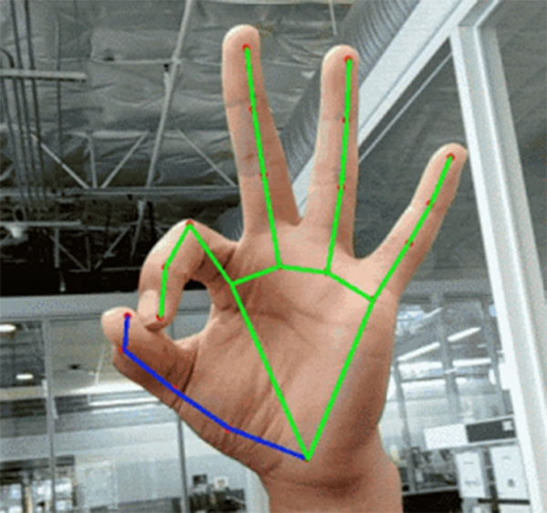

# hand-gesture-recognition-mediapipe


# 环境安装
* mediapipe 0.8.11 或者更高版本
    - pip install -q mediapipe
* OpenCV 3.4.2 或更高
    - pip install opencv
* tensorflow 2.3.0
    - pip install tensorflow==2.3.0

# 项目结构
* hand_gesture
    - hand_gesture_label.csv 手势识别的标签
    - hand_gesture.csv 手势识别训练集
    - hand_gesture.hdf5 手势识别模型
* test_image 测试图片
* vis_result 可视化结果


# 手部关键点检测
```bash
python hand_detection.py
```
输出手部的21个骨骼点，具体定义见下


# 手势识别训练

```bash
python hand_gesture_train.py 
```

# 手势检测+识别
```bash
python hand_recognise.py
```

根据第一步的骨骼点，判断是哪一种手势，目前支持四种
* 张开（open）
* 握拳（close）
* 指向（pointer）
* OK (OK)


